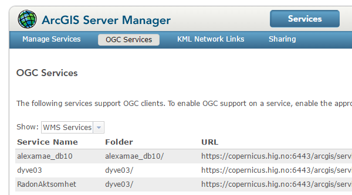
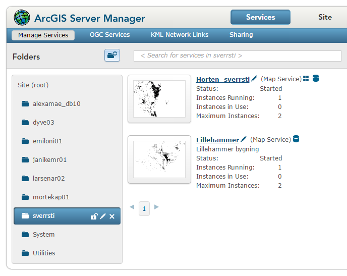
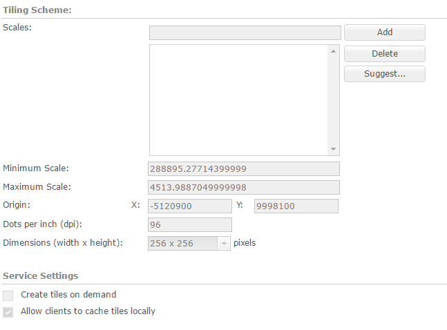
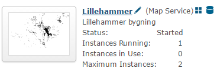

# WMTS: arbeidsgang ved oppretting av tjeneste på ArcGIS Server

## Forutsetninger

- WMS-tjeneste er opprettet fra før.

## Arbeidsoperasjoner

1. Hente ut metadata fra WMS-tjeneste
1. Bestemme zoom-nivåer
1. Opprette tjenesten i ArcGIS Manager
1. Administrere tjenesten fra ArcMap
1. Hente ut metadata fra WMTS-tjeneste


### Hente ut metadata fra WMS-tjeneste

- Finn url for tjenesten:



- Send getcapabilities-kall (#-tegn må byttes ut med og-tegn):

```ini
https://copernicus.hig.no:6443/arcgis/services/sverrsti/Lillehammer/MapServer/WMSServer?
service=wms#
request=getcapabilities#
version=1.3
```

- Hent ut extent-informasjon for aktuelt koordinatsystem:

```xml
BoundingBox CRS="EPSG:25832" minx="556183.820000" miny="6766438.200000" maxx="592522.830000" maxy="6789942.020000"
```

- Navn på aktuelle kartlag:

```xml
<Layer queryable="1">
  <Name>bygning</Name>
  ...
</Layer>
```

### Bestemme zoom-nivåer

Antall zoom-nivåer kan variere, men hvert ekstra zoom-nivå tar plass på serveren. Vi bruker derfor her maksimalt 5 zoom-nivåer.

En passende inndeling for fkb-data kan være målestokkene 25000, 15000, 10000, 5000, 2500.
For andre typer data kan det være mer passende med mindre målestokker, f.eks. 50000 eller mindre.

### Opprette tjenesten i ArcGIS Manager

- Gå inn på Manage services og din mappe i ArcGIS Server Manager



- Velg __caching__. Det skal se ca. slik ut:



- Øverst på siden: velg __Using tiles from a cache__.
- Under __Tiling Scheme__, sett __Suggest__.
- Skriv inn hver målestokk-verdi og trykk __Add__.
- Minimum og maximum scale angir målstokk-området det skal lages kartfliser for. Angi passende verdi.
- Origin er øverste venstre hjørne for __tilematrix__. Sett inn verdier for dette fra metadataene for WMS-tjenesten.
- Trykk på __Save and Restart__. Legg merke til flis-symbolet som kommer opp til høyre for teksten (Map Service). Det viser at dette er en tjeneste med kartfliser.



### Administrere tjenesten fra ArcMap

Hvis du vil slette kartflisene hvs det kanskje ikke ble riktig i første forsøk, kan det gjøres fra ArcMap.

- [Video: 24:30-31:15](https://screencast.uninett.no/relay/ansatt/sverreshig.no/2017/19.01/2629800/GEO3141_-_WMTS_p_AGS_-_20170119_132349_39.html)

### Hente ut metadata fra WMTS-tjeneste

Url for WMTS-metadata hentes ut fra samme sted som WMS-metadata. Velg WMTS i dra-ned-menyen.

```ini
https://copernicus.hig.no:6443/arcgis/rest/services/sverrsti/Lillehammer/MapServer/WMTS/1.0.0/WMTSCapabilities.xml
```

Med denne url'en kan metadata hentes ut direkte - man trenger ikke å føye til de vanlige parametrene for getcapabilities-kall (men resultatet som kommer er likefullt basert på et getcapabilities-kall).

For å lage webkart trenger vi

- __ScaleDenominator__: målestokk-informasjon fra hvert flislag (tilematrix)
- __ows:Identifier__ for Layer: navn på kartlaget
- __ows:Identifier__ for TilematrixSet: fellesnavn for alle flislagene
- __ows:Identifier__ for Tilematrix: navn på flislaget (zoom-nivået)
- __ows:LowerCorner__: nedre venstre hjørne
- __ows:UpperCorner__: øvre høyre hjørne


```xml
<Contents>
<!-- Layer -->
  <Layer>
    <ows:Title>sverrsti_Lillehammer</ows:Title>
    <ows:Identifier>sverrsti_Lillehammer</ows:Identifier>
    <ows:BoundingBox crs="urn:ogc:def:crs:EPSG::25832">
      <ows:LowerCorner>556183.8200000003 6766438.199999999</ows:LowerCorner>
      <ows:UpperCorner>592522.8300000001 6789942.02</ows:UpperCorner>
    </ows:BoundingBox>
    ...
  </Layer>
  <TileMatrixSet>
    ...
    <ows:Identifier>default028mm</ows:Identifier>
    ...
    <TileMatrix>
      <ows:Identifier>0</ows:Identifier>
      <ScaleDenominator>23623.559151877238</ScaleDenominator>
      <TopLeftCorner>556183.82 6789942.02</TopLeftCorner>
      <TileWidth>256</TileWidth>
      <TileHeight>256</TileHeight>
      <MatrixWidth>22</MatrixWidth>
      <MatrixHeight>14</MatrixHeight>
    </TileMatrix>
    ...
  </TileMatrixSet>
</Contents>
```
